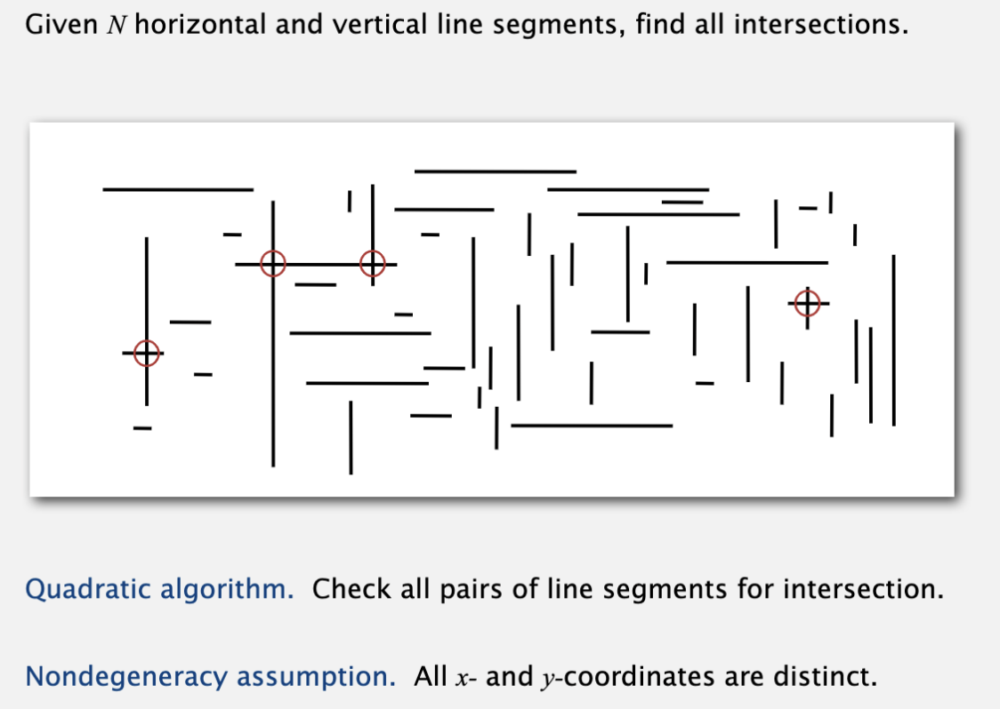

# Geometric application of BST

## 1D range search

线性序列中，查找k1至k2范围内的key数量或key值。

count可以用bst的rank接口实现，O(lgN)

search需要递归的搜索lhs subtree, node, rhs subtree中key在k1~k2范围内的key, O(R + lgN)；

## Line segment intersection

找到所有水平和垂直线段中间的交点。

用bst的解决办法是，用一条竖线从左到右扫描：

* 遇水平线左节点，将该线的y坐标插入bst;
* 遇水平线右节点，将该线的y坐标从bst中删除；（要求所有水平线的y坐标唯一）
* 遇到竖直线，在bst中查找该线y0~y1范围内的key count；（即interval search）

用sweep line可以将2d问题降纬到1维。
