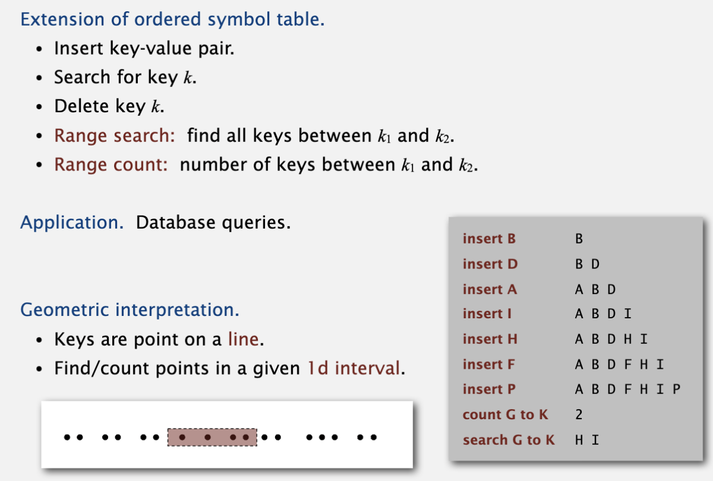

# Geometric application of BST

## 1D range search

线性序列中，查找k1至k2范围内的key数量或key值。

count可以用bst的rank接口实现，O(lgN)

search需要递归的搜索lhs subtree, node, rhs subtree中key在k1~k2范围内的key, O(R + lgN)；

## Line segment intersection

找到所有水平和垂直线段中间的交点。

用bst的解决办法是，用一条竖线从左到右扫描：

* 遇水平线左节点，将该线的y坐标插入bst;
* 遇水平线右节点，将该线的y坐标从bst中删除；（要求所有水平线的y坐标唯一）
* 遇到竖直线，在bst中查找该线y0~y1范围内的key count；（即interval search）

用sweep line可以将2d问题降纬到1维，复杂度O(NlgN)。

## KD tree

### 2D range search

2维的range search：

一种解决方式是将整个平面分成若干个小矩形，range search时只需要检测有交叠的小矩形中的点即可。分的矩形个数为sqrt(N) * sqrt(N)个。

但是这种方式没办法有效处理数据clustering的情况。

引入第二中解决办法，space partitiioning tree，用于将整个平面递归的分成两个区域。

平均时间复杂度 O(R + lgN)，最差为O(R + sqrt(N))

### 2D nearest neighbor

2d tree还有一个应用，查找和query最近的点：这里有一个可加速的点是，如果query点到一个面的最短距离已经大于当前最新的最小距离点，那么这个面内的点到query点的距离都是大于当前最小距离的，因此不需要搜索该平面。

例如当搜索完1的左子树后，找到了5是当前最小距离点，可以计算query到1的右子树平面的最短距离是|query.x - 1.x| > 5到query的距离，因此1的右子树可以不用搜索。

平均时间复杂度为O(lgN)，最差为O(N)

## Interval search

**关键：要把子树的最大endpoint值存在节点内**

## Rectangle intersection

## 总结

BST在应用中，需要做一些适应于问题的数据结构的改善，比如kd tree, intervel search中都有。
