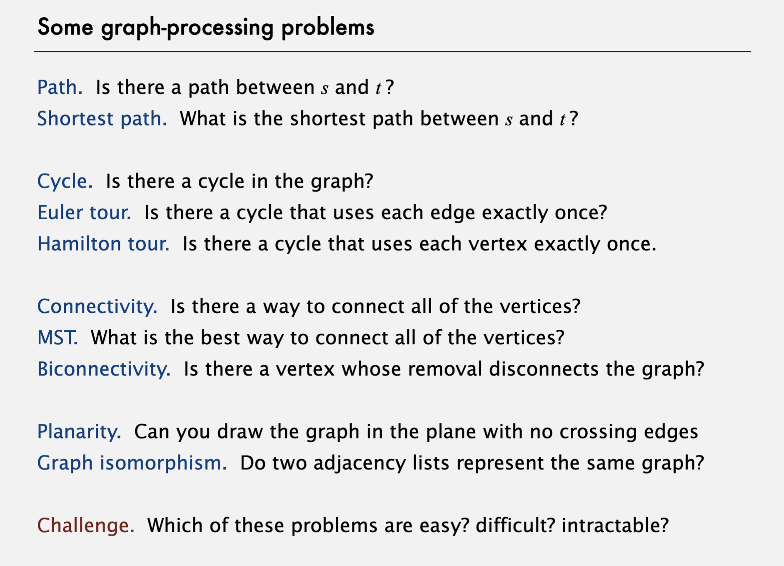
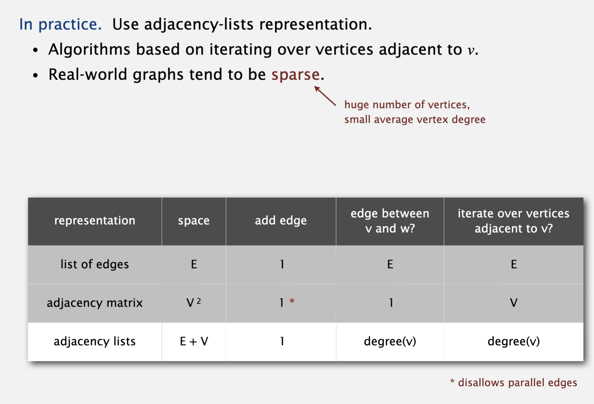
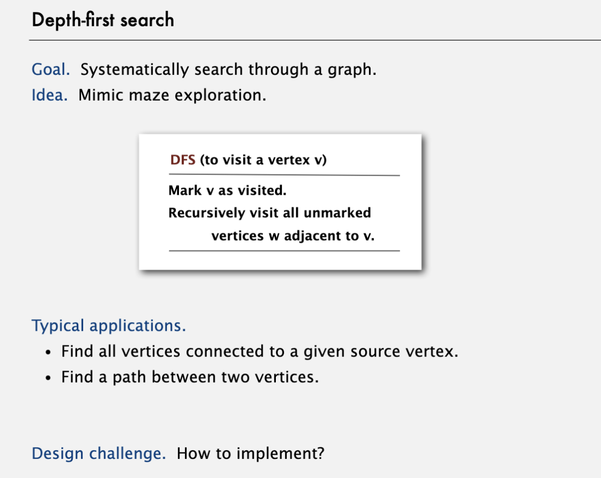
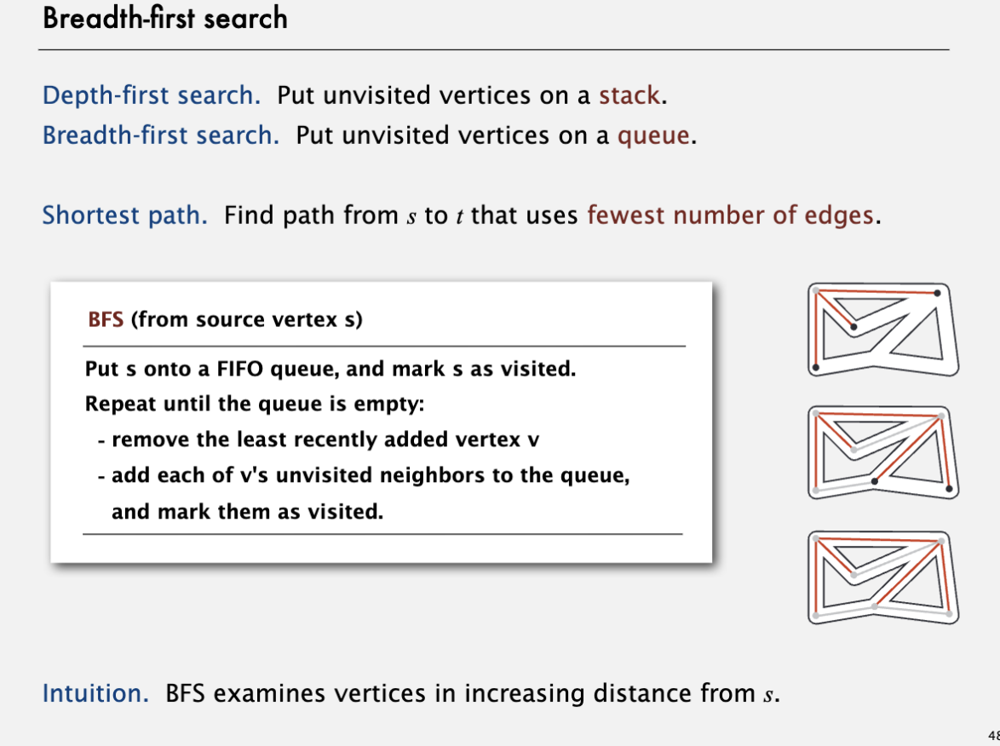
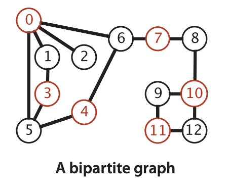

# Undirected graph

由顶点和边组成的形式。

## graph中的基本问题



## Graph的表示

* 用list存储所有的边
* 用邻接矩阵存储，维护一个VxV的二维数组
* 用邻接list存储，list中第i个节点存储与i链接的其他vertex组成的链表



## DFS

深度优先遍历，模拟迷宫探索，可用于查找conneced component和两点之间是否有path链接，实现方式：

* 将当前访问节点设为visited（有一个数组存储节点是否被查找）
* 递归的查询当前节点的临近节点，当所有邻近节点都被访问后，返回到上一节点
* 所有节点都被访问后，遍历结束



## BFS

广度优先搜索，用队列实现，用于寻找不带权重的最短路径；



> DFS（深度优先搜索）和 BFS（广度优先搜索）各有特点和适用场景：
>
> ### DFS（深度优先搜索）
>
> #### 特点
>
> - **递归或栈实现**。
> - **深入优先**：沿一条路径走到底，再回溯。
> - **内存占用小**：对于稀疏图较为高效。
>
> #### 适用场景
>
> - **路径问题**：如寻找任意一条路径。
> - **拓扑排序**。
> - **连通分量**：如判断图的连通性。
> - **迷宫问题**：探索所有可能路径。
>
> ### BFS（广度优先搜索）
>
> #### 特点
>
> - **队列实现**。
> - **层次遍历**：逐层扩展节点。
> - **最短路径**：在未加权图中找到最短路径。
>
> #### 适用场景
>
> - **最短路径问题**：如无权图的最短路径。
> - **广度优先遍历**：如社交网络中寻找某种关系。
> - **连通性检查**：如判断两个节点是否连通。
>
> 选择使用 DFS 或 BFS 取决于具体问题的需求。
>
> DFS 和 BFS 都可以用于路径查找，但在某些方面有所不同：
>
> ### 区别
>
> 1. **路径性质**：
>
>    - **BFS**：在无权图中，BFS 找到的是最短路径，因为它按层次遍历。
>    - **DFS**：可能找到的不是最短路径，深入探索后才回溯。
> 2. **内存使用**：
>
>    - **BFS**：需要存储每一层的节点，内存消耗可能较大。
>    - **DFS**：使用递归或栈，内存消耗通常较小。
>
> ### 特定场景
>
> 1. **循环检测**：
>
>    - **DFS**：可以很方便地检测图中的环。
> 2. **拓扑排序**：
>
>    - **DFS**：适用于有向无环图（DAG）的拓扑排序。
> 3. **迷宫或复杂路径探索**：
>
>    - **DFS**：可以用于探索所有可能路径，适合需要完整搜索的场景。
> 4. **最短路径**：
>
>    - **BFS**：在无权图中最适合用于寻找最短路径。
>
> ### 适用性
>
> - **DFS 能做而 BFS 不能**：
>
>   - 有些需要完整搜索、递归性质的问题更适合 DFS。
> - **BFS 能做而 DFS 不能**：
>
>   - 找到无权图的最短路径问题时，BFS 更为高效。
>
> 选择使用哪个算法取决于问题的具体需求和图的性质。

## Challenge in Graph

* 普通难度：
  * 判断图是否有cycle
  * 判断图是否是bipartite(bipartite是指图中的vertex分为两种颜色，只能不同颜色的vertex相连接)
  * 以上两个问题都可以通过dfs解决



* 较高难度：
  * 判断是否存在Euler tour，并找到Euler tour（从起点开始，每条边有且仅有访问一次，最后回到起始点）

> ### 什么是图中的欧拉回路（Euler Tour）？
>
> 欧拉回路是一个通过图中 **每条边正好一次** 的闭合路径，并且起点和终点相同。如果路径不是闭合的（起点和终点不同），则称为 **欧拉路径（Euler Path）**。
>
> 对于图的欧拉回路问题，图必须满足以下条件：
>
> 1. **无向图**：
>
>    - 每个顶点的度数为偶数。
>    - 图是连通的（忽略孤立点）。
> 2. **有向图**：
>
>    - 每个顶点的入度等于出度。
>    - 图是强连通的（图中的任意顶点都可以通过某种路径到达其他顶点）。
>
> ---
>
> ### 解决方法
>
> 寻找欧拉回路的问题可以通过 **Hierholzer's 算法** 来解决。这个算法适用于无向图和有向图，时间复杂度为 **O(E)**，其中 **E** 是图中的边数。
>
> **步骤：**
>
> 1. 从任意一个顶点出发，沿着未访问的边行走，直到回到起点形成一个环。
> 2. 如果图中还有未访问的边，则从环上的某个顶点出发，重复上述过程，形成新的环。
> 3. 将所有的环合并，形成欧拉回路。
>
> ---
>
> ### C++ 实现
>
> 以下是一个使用 Hierholzer's 算法在无向图中寻找欧拉回路的实现：
>
> ```cpp
> #include <iostream>
> #include <vector>
> #include <stack>
> #include <map>
> #include <set>
>
> class Graph {
> public:
>     std::map<int, std::multiset<int>> adj; // 用 multiset 存储邻接表，支持多条边
>     std::vector<int> eulerTour;            // 存储欧拉回路
>
>     // 添加边
>     void addEdge(int u, int v) {
>         adj[u].insert(v);
>         adj[v].insert(u); // 无向图需要双向添加
>     }
>
>     // Hierholzer's 算法
>     void findEulerTour(int start) {
>         std::stack<int> stack;
>         stack.push(start);
>
>         while (!stack.empty()) {
>             int node = stack.top();
>             if (adj[node].empty()) {
>                 // 如果当前节点没有未访问的边，将其加入欧拉回路
>                 eulerTour.push_back(node);
>                 stack.pop();
>             } else {
>                 // 如果有未访问的边，沿着一条边走
>                 int next = *adj[node].begin();
>                 adj[node].erase(adj[node].begin()); // 删除当前边
>                 adj[next].erase(adj[next].find(node)); // 删除对称边
>                 stack.push(next);
>             }
>         }
>     }
>
>     // 检查是否存在欧拉回路
>     bool hasEulerTour() {
>         for (const auto& [node, edges] : adj) {
>             if (edges.size() % 2 != 0) {
>                 return false; // 存在奇数度的顶点，无欧拉回路
>             }
>         }
>         return true;
>     }
> };
>
> int main() {
>     Graph g;
>
>     // 无向图的边
>     g.addEdge(0, 1);
>     g.addEdge(1, 2);
>     g.addEdge(2, 0);
>     g.addEdge(0, 3);
>     g.addEdge(3, 4);
>     g.addEdge(4, 0);
>
>     // 检查是否有欧拉回路
>     if (!g.hasEulerTour()) {
>         std::cout << "The graph does not have an Euler Tour." << std::endl;
>         return 0;
>     }
>
>     // 找欧拉回路
>     g.findEulerTour(0);
>
>     // 输出欧拉回路
>     std::cout << "Euler Tour: ";
>     for (int node : g.eulerTour) {
>         std::cout << node << " ";
>     }
>     std::cout << std::endl;
>
>     return 0;
> }
> ```
>
> ---
>
> ### 代码解释
>
> 1. **邻接表表示**：
>
>    - 使用 `std::map<int, std::multiset<int>>` 来存储图，`multiset` 支持多条边。
> 2. **Hierholzer's 算法**：
>
>    - 使用栈来模拟路径的深度优先搜索。
>    - 如果当前节点没有未访问的边，则将节点加入欧拉回路。
> 3. **奇数度顶点检查**：
>
>    - 如果任意一个顶点的度数是奇数，则无欧拉回路。
>
> ---
>
> ### 扩展
>
> - 如果是 **有向图**，需要检查每个顶点的入度和出度是否相等。
> - 如果要找 **欧拉路径**，需要调整算法，允许最多两个奇数度顶点（无向图）。

* 高难度：存在hamiltonian tour吗？找到hamiltonian tour
  * NP 问题

>
> ### 什么是图中的 Hamiltonian Tour？
>
> **Hamiltonian Tour（哈密顿回路）** 是指一个通过图中 **每个顶点一次且仅一次** 的闭合路径，并且起点和终点相同。如果路径不是闭合的（起点和终点不同），则称为 **Hamiltonian Path（哈密顿路径）**。
>
> 与欧拉回路不同，哈密顿回路关注的是顶点而不是边。
>
> ---
>
> ### 判定条件
>
> 哈密顿回路问题本质是 NP 完全问题，没有通用的快速算法。因此，通常通过暴力回溯或启发式算法解决。
>
> #### 简单的规则：
>
> 1. **完全图**（如每对顶点之间都有边）必定有哈密顿回路。
> 2. **Dirac's 定理**：对于一个包含 `n` 个顶点的简单图，如果每个顶点的度数 `deg(v) >= n / 2`，则图一定有哈密顿回路。
>
> ---
>
> ### 解决方法
>
> 最基本的方法是通过**回溯法**来尝试寻找路径，验证每种可能的路径是否满足条件。这种方法时间复杂度为 **O(n!)**，适合小规模图。
>
> ---
>
> ### C++ 实现
>
> 以下是通过回溯法在无向图中寻找哈密顿回路的实现：
>
> ```cpp
> #include <iostream>
> #include <vector>
>
> class Graph {
> public:
>     int V;                          // 顶点数
>     std::vector<std::vector<int>> adj; // 邻接矩阵表示图
>
>     Graph(int V) : V(V) {
>         adj.resize(V, std::vector<int>(V, 0));
>     }
>
>     // 添加边
>     void addEdge(int u, int v) {
>         adj[u][v] = 1;
>         adj[v][u] = 1; // 无向图
>     }
>
>     // 检查是否可以将顶点加入路径
>     bool isSafe(int v, std::vector<int>& path, int pos) {
>         // 检查当前顶点是否与上一个顶点相连
>         if (adj[path[pos - 1]][v] == 0) {
>             return false;
>         }
>
>         // 检查当前顶点是否已被访问
>         for (int i = 0; i < pos; i++) {
>             if (path[i] == v) {
>                 return false;
>             }
>         }
>
>         return true;
>     }
>
>     // 回溯函数
>     bool hamCycleUtil(std::vector<int>& path, int pos) {
>         // 如果所有顶点都在路径中，检查是否能形成回路
>         if (pos == V) {
>             return adj[path[pos - 1]][path[0]] == 1; // 检查最后一个顶点是否与起点相连
>         }
>
>         // 尝试所有顶点作为下一个候选
>         for (int v = 1; v < V; v++) {
>             if (isSafe(v, path, pos)) {
>                 path[pos] = v;
>
>                 // 递归寻找路径
>                 if (hamCycleUtil(path, pos + 1)) {
>                     return true;
>                 }
>
>                 // 回溯
>                 path[pos] = -1;
>             }
>         }
>
>         return false;
>     }
>
>     // 主函数：查找哈密顿回路
>     bool hamCycle() {
>         std::vector<int> path(V, -1); // 存储路径
>         path[0] = 0;                 // 起点为 0
>
>         if (!hamCycleUtil(path, 1)) {
>             std::cout << "No Hamiltonian Cycle exists." << std::endl;
>             return false;
>         }
>
>         // 打印哈密顿回路
>         std::cout << "Hamiltonian Cycle: ";
>         for (int i = 0; i < V; i++) {
>             std::cout << path[i] << " ";
>         }
>         std::cout << path[0] << std::endl; // 回到起点
>         return true;
>     }
> };
>
> int main() {
>     Graph g(5);
>
>     // 添加边
>     g.addEdge(0, 1);
>     g.addEdge(0, 3);
>     g.addEdge(1, 2);
>     g.addEdge(1, 3);
>     g.addEdge(2, 3);
>     g.addEdge(2, 4);
>     g.addEdge(3, 4);
>
>     g.hamCycle();
>
>     return 0;
> }
> ```
>
> ---
>
> ### 示例说明
>
> #### 输入图：
>
> ```
> 0 -- 1 -- 2
> |    |   /
> 3 -- 4
> ```
>
> #### 输出：
>
> ```
> Hamiltonian Cycle: 0 1 2 4 3 0
> ```
>
> ---
>
> ### 代码详解
>
> 1. **`isSafe` 函数**：
>
>    - 检查当前顶点是否可以加入路径：
>      - 是否和上一个顶点相连。
>      - 是否已经在路径中。
> 2. **回溯逻辑**：
>
>    - 从起点开始，尝试每个顶点作为下一个顶点。
>    - 如果路径无法完成，则回溯并尝试其他可能性。
> 3. **路径验证**：
>
>    - 如果路径包含所有顶点，则检查最后一个顶点是否与起点相连以形成回路。
>
> ---
>
> ### 优化与扩展
>
> 1. **启发式算法**：
>
>    - 如果图较大，可以使用启发式算法（如遗传算法）来近似求解哈密顿回路。
> 2. **动态规划**：
>
>    - 通过状态压缩 + 动态规划（DP）可以优化到 **O(n * 2^n)**，适合中等规模图。
> 3. **有向图**：
>
>    - 修改 `isSafe` 函数以支持有向图。
>
> ---
>
> ### 总结
>
> - **哈密顿回路** 是一个 NP 完全问题，适合小规模图。
> - 通过回溯可以穷举所有可能的路径并验证。
> - 对于较大规模的图，建议使用启发式或动态规划方法解决。

* 不知道：
  * 两张图是否一样

>
> 要判断两张图（图 G1 和图 G2）在顶点名字（标签）可能不同的情况下是否相同（即它们是 **同构图**），需要验证两张图的结构是否一致。图的同构性问题是一个经典的计算问题。
>
> ---
>
> ### **什么是图的同构性？**
>
> 两张图是同构的（Isomorphic）如果：
>
> 1. 两张图的顶点数相等。
> 2. 两张图的边数相等。
> 3. 可以通过重新标记顶点将一张图的结构转换为另一张图。
>
> 换句话说，图 G1 和 G2 是同构的，当且仅当存在一个顶点的重新排列，使得 G1 的邻接关系与 G2 的邻接关系完全一致。
>
> ---
>
> ### **解决方法**
>
> 解决图同构问题的常用方法包括：
>
> 1. **暴力法**：枚举顶点的所有排列并检查邻接关系（适合顶点数较少的图，时间复杂度为 O(n!)）。
> 2. **哈希法**：通过特征（如顶点度数分布）快速排除明显不满足同构的图。
> 3. **库支持**：使用专门的图同构算法库（如 Boost Graph Library）。
>
> 以下是通过暴力枚举法实现的解决方式：
>
> ---
>
> ### **C++ 实现**
>
> ```cpp
> #include <iostream>
> #include <vector>
> #include <algorithm>
>
> // 检查两张图的邻接矩阵是否相同
> bool areGraphsIsomorphic(const std::vector<std::vector<int>>& adj1, const std::vector<std::vector<int>>& adj2) {
>     int n = adj1.size();
>     if (adj2.size() != n) return false;
>
>     // 用于存储顶点的排列
>     std::vector<int> permutation(n);
>     for (int i = 0; i < n; ++i) {
>         permutation[i] = i;
>     }
>
>     // 尝试所有顶点的排列
>     do {
>         bool isIsomorphic = true;
>
>         // 检查当前排列是否使两张图的邻接矩阵一致
>         for (int i = 0; i < n && isIsomorphic; ++i) {
>             for (int j = 0; j < n; ++j) {
>                 if (adj1[i][j] != adj2[permutation[i]][permutation[j]]) {
>                     isIsomorphic = false;
>                     break;
>                 }
>             }
>         }
>
>         if (isIsomorphic) return true; // 找到同构
>     } while (std::next_permutation(permutation.begin(), permutation.end()));
>
>     return false; // 没有找到同构
> }
>
> int main() {
>     // 图 1 的邻接矩阵
>     std::vector<std::vector<int>> graph1 = {
>         {0, 1, 1, 0},
>         {1, 0, 1, 0},
>         {1, 1, 0, 1},
>         {0, 0, 1, 0}
>     };
>
>     // 图 2 的邻接矩阵
>     std::vector<std::vector<int>> graph2 = {
>         {0, 1, 0, 1},
>         {1, 0, 1, 1},
>         {0, 1, 0, 1},
>         {1, 1, 1, 0}
>     };
>
>     if (areGraphsIsomorphic(graph1, graph2)) {
>         std::cout << "The graphs are isomorphic!" << std::endl;
>     } else {
>         std::cout << "The graphs are not isomorphic!" << std::endl;
>     }
>
>     return 0;
> }
> ```
> ---
>
> ### **代码说明**
>
> 1. **输入：**
>
>    - 图以邻接矩阵表示，`adj1` 和 `adj2` 是两张图的邻接矩阵。
>    - `adj[i][j] == 1` 表示从顶点 i 到顶点 j 存在边，`0` 表示不存在。
> 2. **暴力法：**
>
>    - 生成所有顶点的排列（通过 `std::next_permutation`）。
>    - 根据排列重新映射图 2 的邻接矩阵，并与图 1 比较。
> 3. **复杂度：**
>
>    - 时间复杂度为 O(n! * n^2)，其中 n 是顶点数。适用于小规模图。
> 4. **输出：**
>
>    - 如果找到满足同构关系的排列，则输出两图同构；否则输出两图不同构。
>
> ---
>
> ### **改进方法**
>
> 对于较大规模的图，可以通过以下优化：
>
> 1. **顶点度数分组：**
>
>    - 首先检查两图的顶点度数分布是否一致。如果不一致，直接判定为不同构。
>    - 将度数相同的顶点分到同一组，减少排列的次数。
> 2. **特征哈希：**
>
>    - 利用图的特征哈希（如顶点的局部结构、路径分布等），快速判断两图是否可能同构。
> 3. **库支持：**
>
>    - 使用专业的图处理库，如 Boost Graph Library（BGL），其中包含高效的图同构算法。
>
> ---
>
> ### **Boost Graph Library 示例**
>
> 如果需要更高效的解决方案，可以使用 Boost Graph Library：
>
> ```cpp
> #include <iostream>
> #include <boost/graph/adjacency_list.hpp>
> #include <boost/graph/isomorphism.hpp>
>
> int main() {
>     using namespace boost;
>
>     // 定义图
>     typedef adjacency_list<vecS, vecS, undirectedS> Graph;
>
>     // 图 1
>     Graph g1(4);
>     add_edge(0, 1, g1);
>     add_edge(0, 2, g1);
>     add_edge(1, 2, g1);
>     add_edge(2, 3, g1);
>
>     // 图 2
>     Graph g2(4);
>     add_edge(0, 1, g2);
>     add_edge(0, 3, g2);
>     add_edge(1, 3, g2);
>     add_edge(1, 2, g2);
>
>     // 检查是否同构
>     bool isomorphic = isomorphism(g1, g2);
>     if (isomorphic) {
>         std::cout << "The graphs are isomorphic!" << std::endl;
>     } else {
>         std::cout << "The graphs are not isomorphic!" << std::endl;
>     }
>
>     return 0;
> }
> ```
> ---
>
> ### **总结**
>
> - **暴力法** 是简单易实现的方式，但仅适用于小规模图。
> - **优化方法**（如度数分组、特征哈希）可以提高效率。
> - 对于大规模图，建议使用专业库（如 Boost Graph Library），提供高效的同构检查工具。
