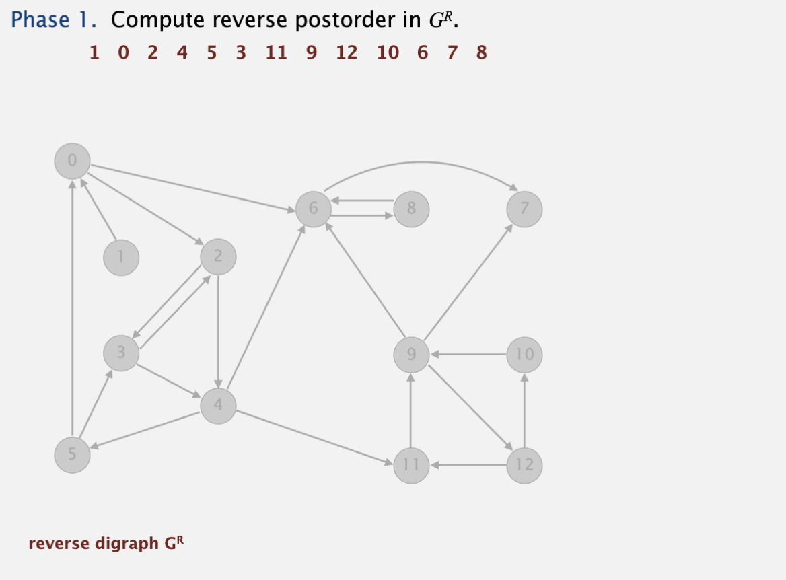

# Digraph

## 应用

## Problem

## Reachability

从s出发，哪些vertex是可访问的，即可reachability。

可以通过DFS算法解决reach ability问题，有向图和无向图的DFS算法是一样的。

应用包含：

* control flow analysis: node表示basic block，edge表示jump

  * dead code elimination:找到unreachability的node
  * infinite loop detection：检查exit是不是reach ability
* garbage collector：node表示对象，edge表示reference

  * 从root出发，回收unreachability对象

dfs的应用包括：

BFS的应用：

* shortest path：无权重edge的digraph
* 网络爬虫：从一个跟节点，扒出所有网页的内容

## Topological sort

常见的应用场景是，一系列的task及task之间的依赖关系，找出一种schedule task的方法。

要求必须是DAG，即有向无环图，才可以topological sort。

方法：用dfs遍历，遍历完邻近节点后，再将本节点入栈，从栈pop的顺序即topological顺序。

## Strong connected components

即SCC中，任意两个vertex v和w间都有，v to w的path和w to v的path。

> 图的强连通性在许多领域内都有重要的应用，以下是几个典型的应用场景：
>
> 1. **网络分析**：在互联网和社交网络中，强连通性可以用来分析用户之间的连接强度。如果一个社交网络中的每个成员都能通过某种路径直接或间接地联系到其他的每个成员，则该网络被认为是强连通的。这种性质对于理解信息传播路径和群体凝聚力非常有用。
> 2. **路由算法**：在网络通信的背景下，强连通性有助于设计更有效的路由算法。在一个网络中如果能够确保所有节点之间都能互相访问，则可以提高数据传输的效率和可靠性。
> 3. **软件工程**：在系统设计中，理解组件之间的交互关系非常关键。强连通性可以帮助软件工程师识别出系统模块间的依赖关系，从而更好地组织代码结构，比如在分析程序调用图时确保每个模块都能访问到所有需要的其他模块。
> 4. **生物信息学**：在蛋白质交互网络或基因调控网络的研究中，强连通性的分析可以帮助科学家理解生物过程中的信息传递路径。例如，在蛋白质交互网络中，如果一个蛋白可以通过一系列相互作用与其他所有蛋白相连，则表明这个蛋白在网络中起着关键的作用。
> 5. **数学建模与理论研究**：在图论的研究中，强连通性的概念本身就是一个重要的研究对象。理解不同种类的图（如二分图、欧拉图等）是否或者如何成为强连通性的，可以帮助开发新的算法和理论。
>
> 总之，通过研究图的强连通性，可以为理解复杂系统中的关系模式提供有力工具。这种分析不仅限于技术领域，在社会科学和自然科学中也有广泛的应用。

Kosaraju-Sharir算法寻找scc，算法复杂度O(E+V)

* 第一步，计算reversed G的postorder
* 第二步，根据第一步的postorder，dfs遍历G，能visits的vertex就属于同一个scc

直觉上是什么样？

postorder就是从第一个vertex可以访问其他的vertex，如果在reverse G中，依然有第一个vertex访问后面的vertex，那就是满足v to w和w to v的条件了。

