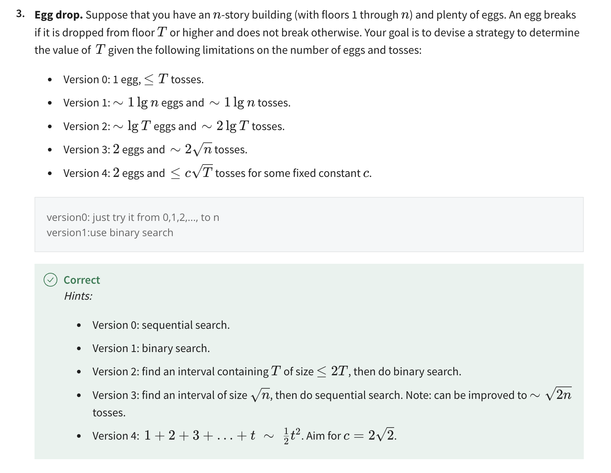

## Cost of operations
- memory alloc是 cN，和大小有关；
- string concat：s + t，也是cN的时间；
- 其余基本都是常数开销

## 常见的复杂度
- 1 + 2 + ... + N ～ 相当于是对f(x) = x积分，结果就是N^2
- 1^k + 2^k + ... + N^k ~ 相当于是对f(x) = x^k积分，结果就是N^(k+1)
- 1 + 1/2 + ... + 1/N ~ 相当于是对f(x) = 1/x积分，结果就是lg N
  
## Order of growth
- 1, lg N, N, N*lg N, N^2, N^3, 2^N

## type of analyses
- Best case
- Worst case
- Average case

## example
- three sum
- binary search

## homework
- bitonic search
- egg drop

  - 说明：
    - version2: 通过egg数量，估算T的值，2^egg ~ T，选择一个值，然后做二分查找
    - version4: 构建差为1等等差数列，1 + 2 + ... + x = (x + 1) * x / 2 > n，求出最小的x。假设x = 15，第一次以在15层扔，如果碎了，顺序查找0～14；如果没碎，第二次在15 + 14 = 29层查找。接下来重复上述步骤。