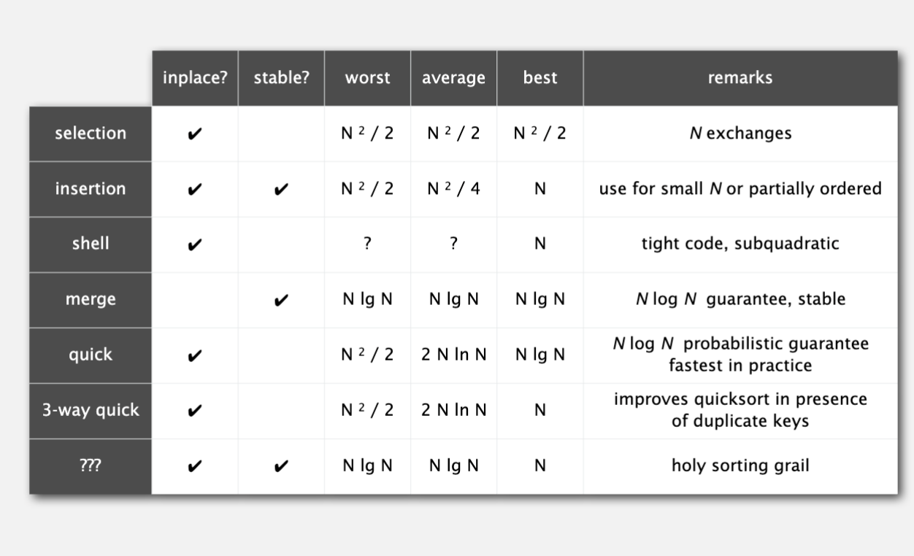

# Sorting

## Selection sort

在i次迭代时，找到剩余未排序中最小值的序号min，交换a[i]和a[min]。

算法复杂度：

* 算法有（N-1) + (N-2) + ...+ 1 + 0 ~ N^2/2次比较
* N次swap

选择排序的优点是交换次数少，缺点是无论如何都需要N^2/2次比较。

## Insertion sort

在第i次迭代，交换左侧已排序中比a[i]大的值和a[i]。插入排序中如果a[i-1]<a[i]，说明a[i]已经是最大的，提前结束i次迭代。

算法复杂度：

* N^2/4次比较
* N^2/4次swap

最好case，已经是有序的排列，只需要做N-1次比较即可；最差的情况是倒序，需要N^2/2次比较+N^2/2次比较。

## Shell sort

希尔排序是一种插入排序的扩展，插入排序中每次比较交换的步长为1，希尔排序中可以更大的步长交换，通过大步长逐渐减小到1步长，实现整体有序。

通常使用的步长有3x+1: 1, 4, 13, 40...。其算法复杂度为O(N^1.5)

## Shuffle

和sorting相反，将数组打乱，均匀的打乱。

一种方法就是，生成一组随机数，与原数组一一对应，将随机数排序，自然就可以达到原数组shuffle的过程。

Knuth shuffle是一个O(N)的shuffle算法，在第i次迭代，生成一个[0,i]范围内的随机数r，交换a[i]和a[r]。

## Convex hull

> Convex hull是计算几何中的一个基本概念，用于描述一个点集的最小凸包。简单来说，给定一个平面上的点集，Convex hull是包含所有这些点的最小凸多边形（或凸包）。
>
> 要更直观地理解这一点，可以想象将这些点放在一块平板上，然后用一根橡皮筋把它们包围起来。当橡皮筋紧贴住点集时，所形成的边界就是Convex hull。这意味着Convex hull的边界是由这些点中最外层的点组成的，而边界内的所有点都在这个凸多边形之内。
>
> ### 特性：
>
> 1. **凸性**：Convex hull是凸的，即对于多边形内的任意两点，连接这两点的线段完全位于多边形内部。
> 2. **唯一性**：给定一个点集，Convex hull是唯一的。
> 3. **最小包围**：它是包含所有点的最小凸多边形，即没有其他更小的凸多边形能够完全包围这些点。
>
> ### 应用：
>
> Convex hull在计算几何、计算机图形学、模式识别等领域有广泛应用。例如，在图像处理中，它可以用于物体检测，帮助确定物体的外边界。
>
> Convex hull的计算方法包括Graham扫描、Jarvis步进法等，它们都基于对点集进行排序和边界点的选取。
>
> 通过这些方法，Convex hull可以有效地帮助我们理解和处理复杂的几何问题。

应用举例：

* 路径规划，绕过由一系列点所形成的多边形障碍，从s点到达t点，其实就是找到包含s,t及障碍点的convex hell，选出最短路径
* 两点最远距离，找出一系列点中任意两点最大欧拉距离的组合，其实就是照convex hell，再计算顶点的距离。

## Merge sort

将数组分为两半，递归的排序每一半，然后再合并两半。

* Merge是一个O(N)复杂度的，Merge sort会有lgN次Merge，总的算法复杂度是NlgN。D(N) = 2D(N/2) + N -> D(N) / N = D(N/2) / (N/2) + 1 = D(N/4) / (N/4) + 1 + 1 = D(N/N) / (N/N) + 1 + ... + 1 -> D(N) = NlgN
* 空间复杂度：在Merge中，需要有一份copy原数组的过程，merge sort使用了额外N array的memory。
* merge sort无论最好还是最差都是NlgN的复杂度

优化：

* 当数组长度小时，直接使用插入排序，避免overhead
* merge前如果发现lhs/rhs已经有序，有可能不需要merge
* merge不需要提前copy

> Stability: seletction sort, shell sort, quick sort is not stable, insertion sort and merge sort is stable.

## Quick sort

shuffle数组；partition，选取一个pivot，将数组分成小于pivot和大于pivot两组；两组分别递归的sort。

* partition可以是inplace完成，能节省memory space。
* partition过程是O(N)，而整个有lgN次，时间复杂度是NlgN
* quick sort的最差情况，O(N^2)退化成选择排序；避免最差情况出现，最好做shuffle，另外选择pivot也要有一个好的方法。

quick sort相比于merge sort，它的compares更多，但data movements更少，所以快一点。

优化：

* 当数组长度小时，直接使用插入排序，避免overhead
* 选择pivot的时候，可以找3个值的中间值，避免最差情况出现

### top k

通过quick sort可以演变出top k的算法，选出数组中最小的k个数。在partition时通过lhs, rhs的size，当lhs size为k时结束。

其复杂度为O(N)。

