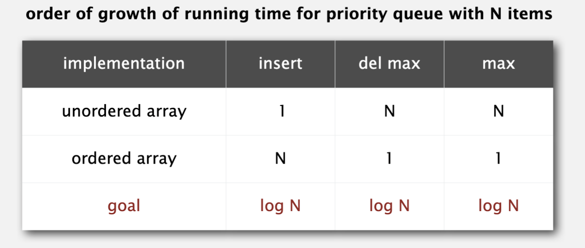
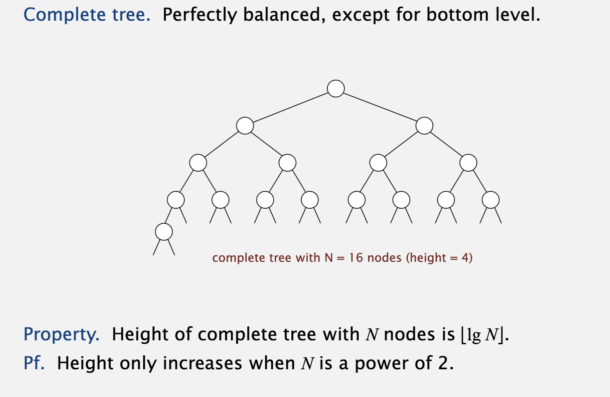
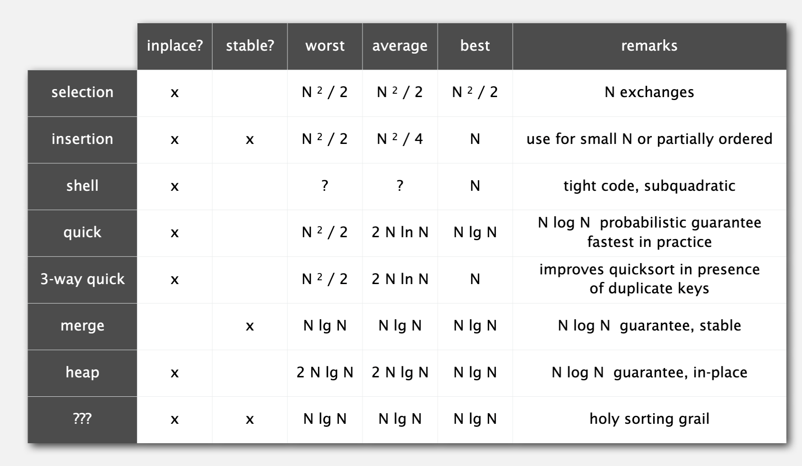

# Priority Queue

Queue是FIFO，先进先出，出的顺序是时间决定。

Random Queue随机出。

Priority Queue是每次出最大（小）的值。

## Application

从N个item中找到最大（小）的M个元素，即Top K问题。我们可以构建一个M size的最小堆，每插入一个元素，检查size如果>M，则POP出最小值。如果使用binary heap存储M，维护最小堆的代价为log M，他的复杂度应该是logM * N。

## Inplementation

有三种方式实现：

* unorder array存储，坏处是删除最大值需要遍历；
* order array存储，坏处是插入是需要遍历找到自己的插入位置；
* binary heap存储，可以达到lgN的复杂度；

> 什么是binary heap？
>
> 二叉堆是一种完全二叉树，具有以下特性：
>
> 1. **最大堆** ：每个节点的值都大于或等于其子节点的值，最大值位于根节点。
> 2. **最小堆** ：每个节点的值都小于或等于其子节点的值，最小值位于根节点。
>
> ### 特性
>
> * **完全二叉树** ：除最后一层外，所有层都是满的，最后一层的节点从左到右排列。**他是平衡二叉树。**
> * **堆性质** ：
> * 最大堆：父节点的值大于或等于子节点。
> * 最小堆：父节点的值小于或等于子节点。
>
> 

通过array实现binary heap，其根节点在a[1]，a[k]的子节点在a[2k]和a[2k+1]。

## Heap sort

通过binary heap实现sorting，构建时通过bottom-up的方式，优先调整子树；删除时将最大值swap到array的后部。

Heap sort的特点是inplace并且NlogN性能保证的sorting算法，它是非stable sorting。

* Merge sort虽然是Nlog N性能保证，但是不是inplace
* Quick sort虽然是inplace，但最差情况是O(N^2)

