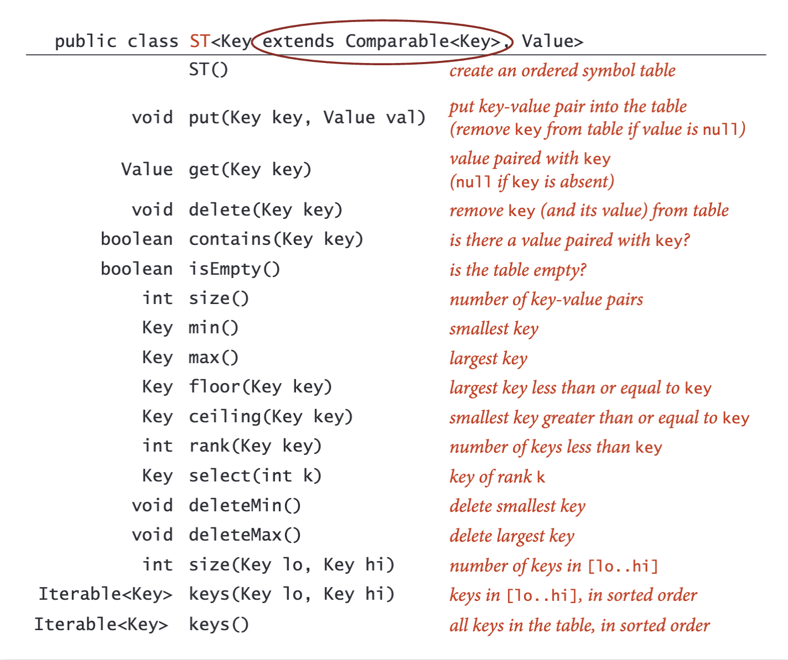

# Symbol Table

符号表，其实就是cpp中的map，或者python中的dict。

## 实现方式

本章介绍了两种：

* 使用unorded array存储，查询和插入都需要O(N)，因为插入需要先查询key是否已存在，若存在，覆盖val；若不存在，在array尾部插入(key, val)。unorder array的方式，只需要key能实现==(equal)即可；
* 使用ordered array存储，查询可用二分查找O(lgN)，插入有可能导致array需要move元素O(N)。需要key实现<(compare)。
* 有没有查询/插入/删除都是O(lgN)的方式呢？
  * 有，即BST（二叉搜索树）

## API

ST的API包含：

* floor(key)找st中最大<= key的pair
* ceil(key)找st中最小>=key的pair
* rank(key)找到<key的pair个数
* select(k)找到rank(key)==k的key

