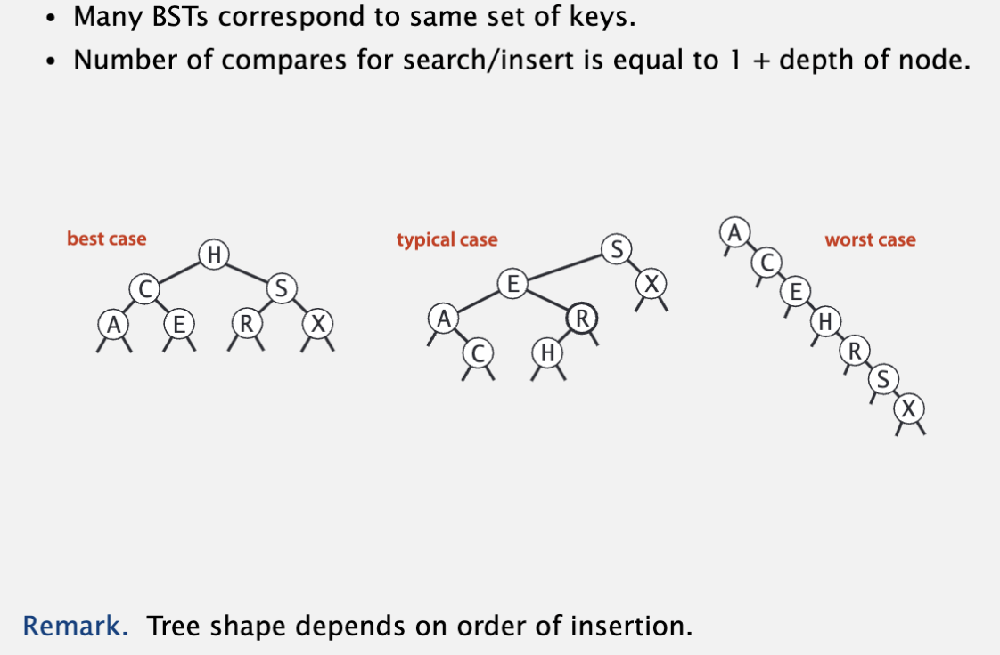
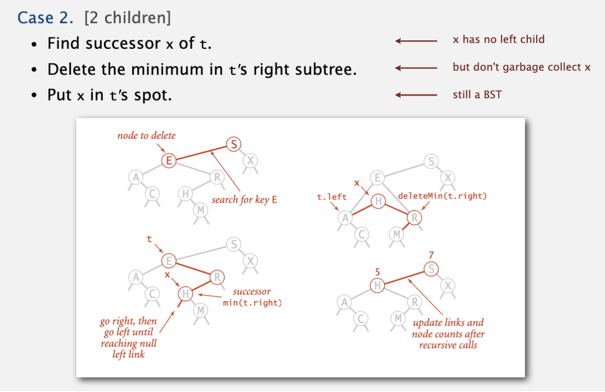
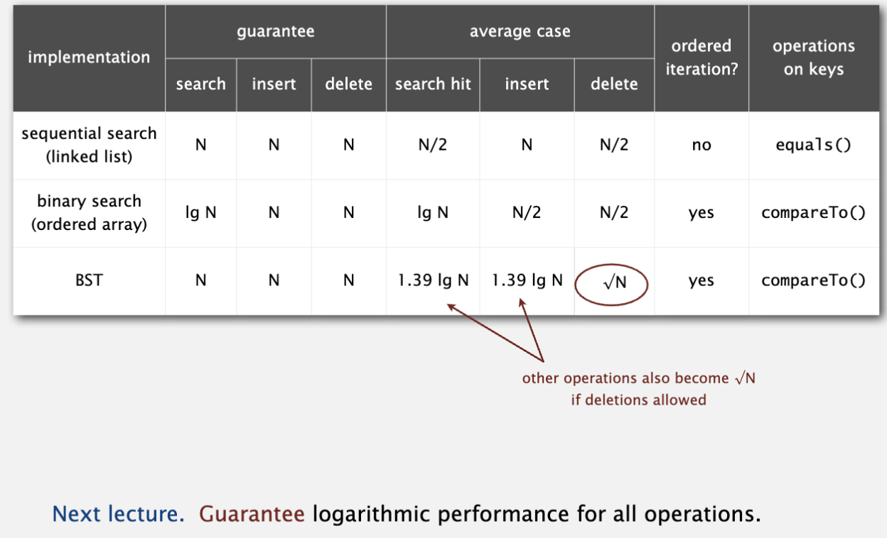

# Binary Search Tree

它是一颗二叉树，且父节点大于左子树，父节点小于右子树。理论上，N个节点的bst平均树高为lgN，因此平均查询和插入的开销就是lgN。

但bst的最坏情况下，会退化成链表，也就是查询和插入都是O(N)，这是因为bst的形状是和插入顺序相关的，同样一组数据，不同的插入循序将导致不同的形状。

Inorder遍历，先遍历左子树->父节点->右子树，输出的是从小到大的升序排列。

## Deletion in bst

Hibbard deletion: 经过hibbard delete之后，树会变得更不平衡，插入/查询/删除的cost 会增加为~ sqrt(N)

* 删除的节点没有child，父节点设置为null;
* 删除的节点有一个child，父节点指向子节点；
* 删除的节点有两个child，该节点的继任者是右子树的最小值（或者左子树的最大值）；

由于树不平衡导致查询/插入等操作的效率下降，那有没有更好的方法呢？

当然有，2-3 tree和red-black tree。
