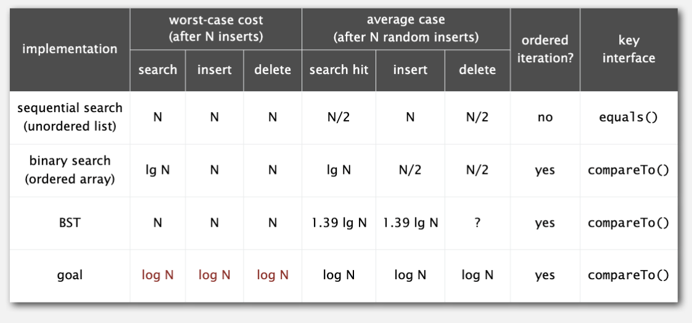
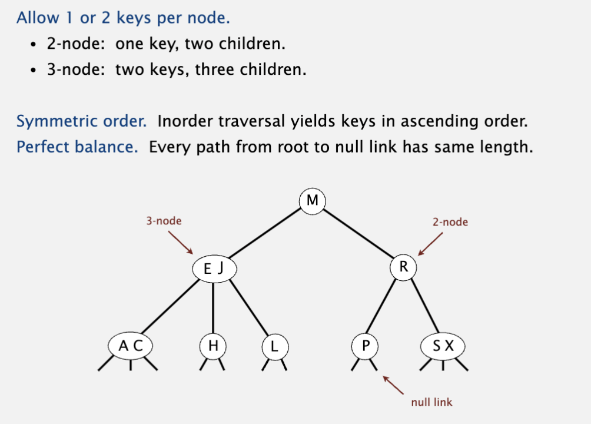
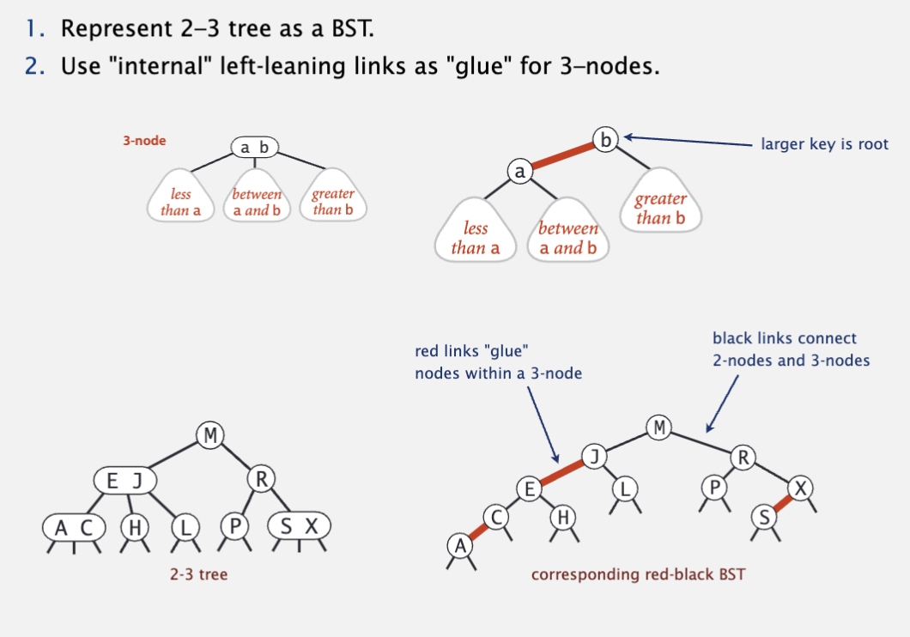
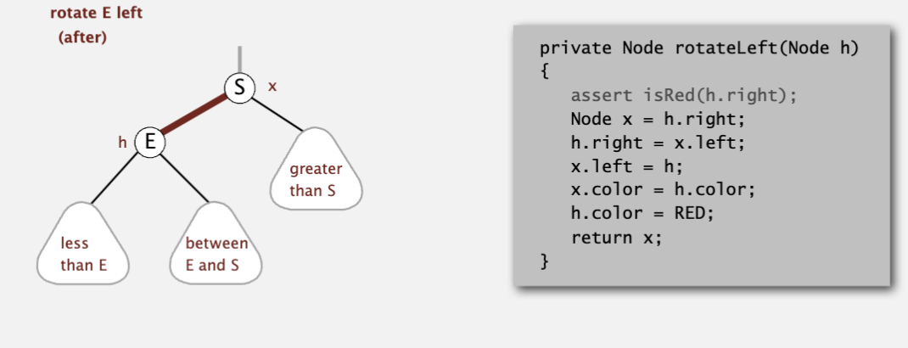
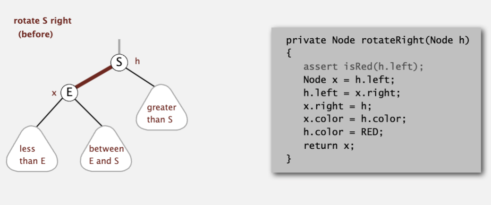
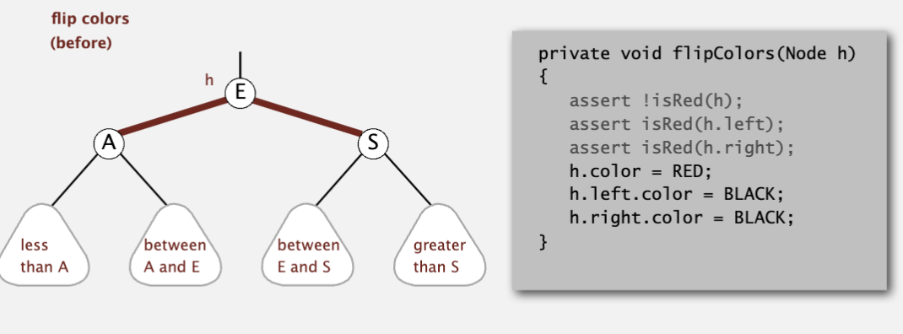
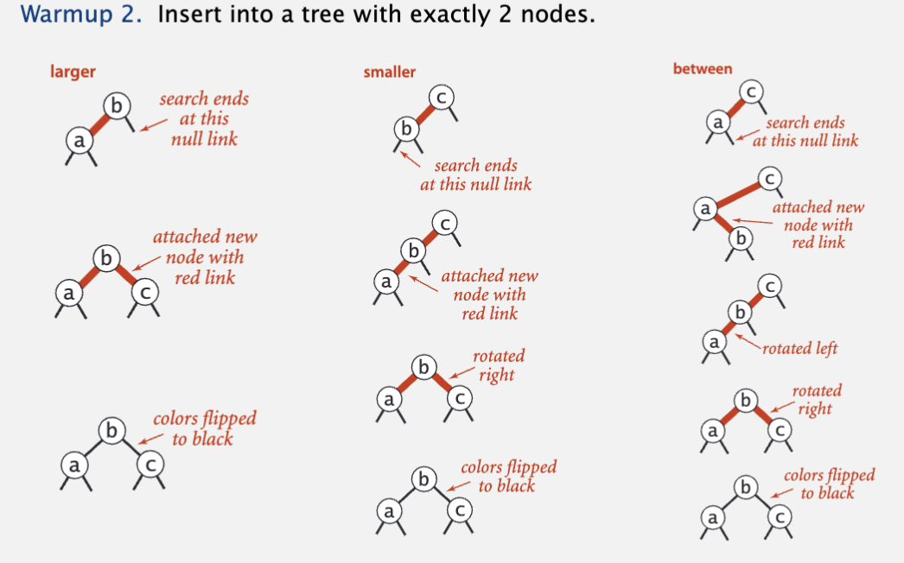
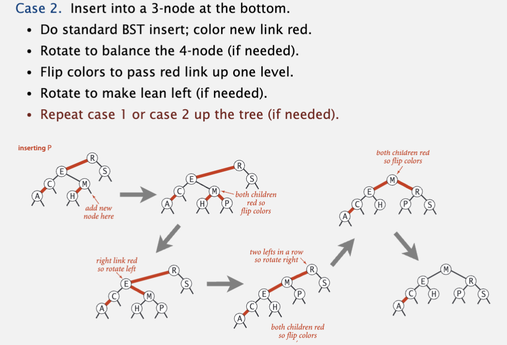
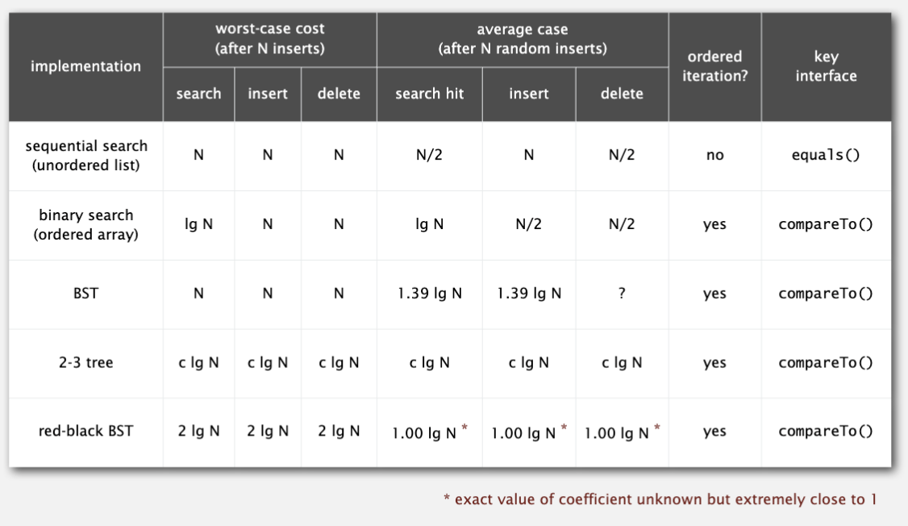

# Balance search tree

从前面的二叉搜索树中，我们可以看到，bst只能保证O(N)的效率，原因是bst可能因插入和删除导致不平衡。因此这一章节讲述的是平衡搜索树。

## 2-3 Tree

允许父节点有两个key和三个字节点，中间节点介于两个key之间。

完美的平衡树。

>
> 在 2-3 树中，插入操作通过保持树的平衡来进行。以下是插入的步骤：
>
> 1. **找到插入位置**: 从根节点开始，找到适当的叶节点插入新元素。
> 2. **插入元素**:
>
>    - 如果叶节点有一个元素，将新元素插入，节点变成一个 3-节点。
>    - 如果叶节点已经是一个 3-节点，则需要分裂。
> 3. **节点分裂**:
>
>    - 将 3-节点分裂为两个 2-节点，并将中间元素提升到父节点。
>    - 如果父节点也是 3-节点，则继续分裂并提升到更高层。
> 4. **调整树结构**:
>
>    - 通过分裂和提升，维护树的平衡。
>    - 如果根节点分裂，树的高度增加一层。
>
> 这种递归分裂和提升的过程确保 2-3 树始终保持平衡，所有叶节点的深度相同。

## Red black tree

用红黑树表达2-3树，用红色边链接的两个node就是2-3 tree中的3 node。

这样2-3树就和红黑树可以一一对应。

它的性质包含：

* 一个node不会有两条红边和它链接；
* 叶节点到root的path中所包含的黑边的条数相等；
* 所有红边都是左倾（左倾红黑树）；

有三种特殊操作：

* left rotation:将右倾红边左倾；
* right rotation：将左倾红边右倾；
* color flip: 当一个节点的左右子节点都是红边，需要把自己置为红边，子节点置为黑边；（对应于2-3 tree中temporary 4 node的分裂，并将中间key合入父节点的过程）

